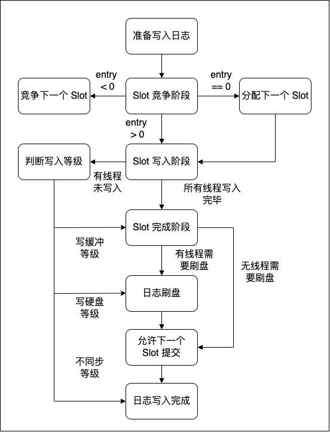

# MLog

## 项目介绍

MLog 是一个玩具项目，仿照了 MongoDB 中的事务组提交日志机制写成。该日志提交机制可以参考 https://www.mongodb.com/blog/post/breaking-wired-tiger-logjam-write-ahead-log。

该日志系统主要思想可以概括为以下几点：

- 日志组提交采取锁来同步，但获取锁失败并不会阻塞线程
- 并发写入日志缓冲区不需要加锁
- 日志缓冲区写入硬盘需要使用版本号约束
- 每个线程可以选择日志的同步等级
- 不需要后台线程写入日志

该日志系统更加适合需要高安全等级日志的情况，如数据库系统；而不适合作为普通的日志系统来使用，因为至少一个用户线程会被日志写入操作阻塞直至写入硬盘缓冲区。

## Wiredtiger Journal 设计亮点

Wiredtiger 中的日志系统设计参考了论文 Scalability of write-ahead logging on multicore and multisocket hardware，链接为 https://infoscience.epfl.ch/record/170505/files/aether-smpfulltext.pdf。

### 日志组提交模式

用户在写日志时，对于日志缓冲区的竞争是无锁的，只使用原子标志来进行同步。日志写入的流程如下：

在 Slot 的竞争阶段，不同的线程会竞争修改Slot 的原子标志。若修改成功，则线程需要负责分配下一个 Slot；若修改失败，则会根据返回的 entry 位置，将日志拷贝到 Slot 中；如果下一个Slot 分配完成，则本 Slot 禁止写入，返回的 entry < 0，线程需要再次竞争下一个 Slot。

当线程完成 Slot 的写入，可以根据日志写入等级选择返回时机，而最后一个完成写入的线程则需要负责将 Slot 写入硬盘缓冲区，若该 Slot 中有现成要求写入硬盘，则进行刷盘操作。

### 自由调控日志等级

由于每一个用户线程都深度参与了日志的提交过程，用户线程具有三个时机可以返回：1、写入日志缓冲区。2、写入硬盘缓冲区。3、写入硬盘。这种自由度允许了 MongoDB 的 CRUD 操作具备了更高的调控等级：不写日志、日志写入缓冲区、日志写入硬盘，对于一些高写入压力的场景，如分布式日志，数据采集系统，可以根据具体情况来选择日志等级，加快客户端的提交速度。

### 轻量级缓冲区

相比于 InnoDB 中采用 Log File 缓冲区，WiredTiger 中的缓冲区量级要更小。这是因为 MongoDB 中需要写入日志的线程数量更多，经常会大于 CPU 的核数，如果采用大缓冲区，各个线程之间对锁的竞争力度会很大。采用更小的缓冲区，并且采用 join 机制，虽然各个线程仍然存在竞争，但是竞争失败并不会阻塞线程，只是会调整线程的活动模式。这种设计在面对短时间内的高并发写入，能够保证日志写入的高效性。

### 无后台线程负责写入日志

传统的后台线程写入的日志模式在无日志缓冲区时会陷入阻塞，而唤醒线程则需要花费 20us 左右的时间，而这一延迟按照论文中的方法是可以优化的，也就是 Wiredtiger 中采取的日志模式。当发生 少量写入操作到达———短时间空闲———少量写入操作到达，这种情况；传统的后台日志写入模式可能就会损耗较大的性能。

